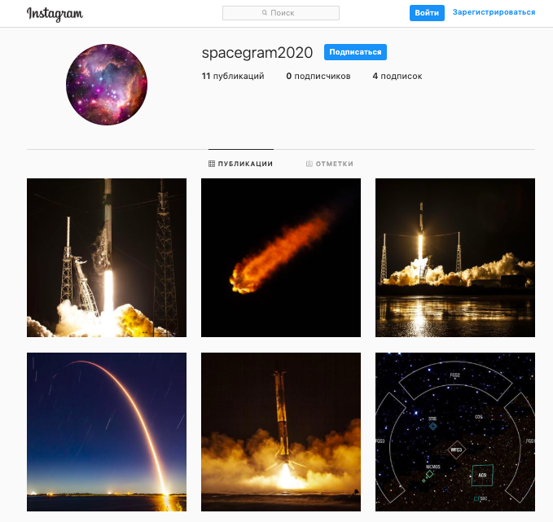

## Spacegram

Spacegram - утилита, помогающая собирать и постить фотки космоса в Instagram.
Для сбора фотографий используется [API SpaceX](https://documenter.getpostman.com/view/2025350/RWaEzAiG?version=latest#bc65ba60-decf-4289-bb04-4ca9df01b9c1) (можно ещё посмотреть [репозиторий на GitHub](https://github.com/r-spacex/SpaceX-API)) и [API Hubble](http://hubblesite.org/api/documentation)

## Запуск

- Скачайте код
- Создайте виртуальное окружение
- Установите библеотеки, необходимые для работы, перечисленные в `requirements.txt`, используя 

`pip install -r requirements.txt`

- Зарегистрируйтесь в [Instagram](https://www.instagram.com/)
- Полученные логин и пароль сохраните в файл `settings.py`, в формате

    LOGIN = 'Ваш логин'
    PASSWORD = 'Ваш пароль'

- API SpaseX и API Hubble не требуют авторизации
- Запустите скрипт командой `python main.py`
- Скрипт создаст папку `images` и, используя API, соберет в неё фотографии и опубликует в Вашем аккаунте Instagram 

Не все скаченные фото, будут опубликованы, в случае возникновения ошибок при скачивании/публикации фото, скрипт проигнорирует поврежденные/неподходящие файлы.

## Цели проекта

Код написан в учебных целях — это урок в курсе по Python и веб-разработке на сайте [Devman](https://dvmn.org).
